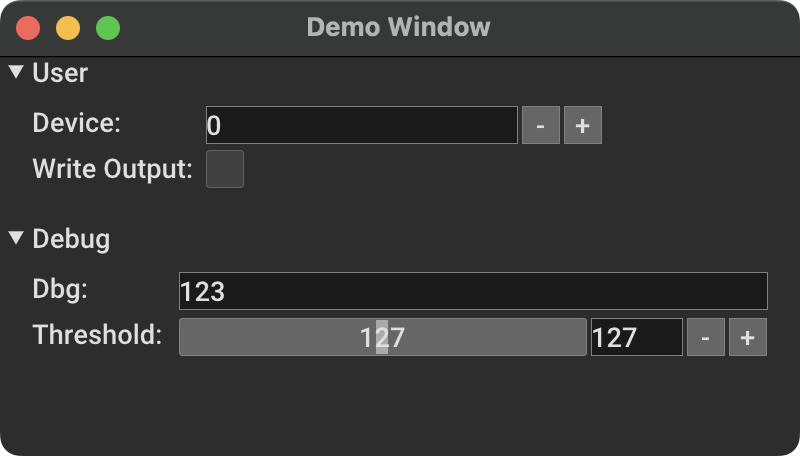

# Documentation

Almost every application has a configuration that contains various attributes defining how it operates. These attributes typically reside in a data model which represents the application's data. In Python, we can design a class with attributes to represent the data. `duit` provides valuable tools and methods to work with data models that facilitate recurring implementation. The documentation provides guidance on implementing common requirements such as serialization or observability.

This documentation gives an insight into the features of `duit` and explains the core concepts of the library.

## Event

One of the central elements of duit is the `duit.event.Event.Event` class which implements the traditional [observer pattern](https://en.wikipedia.org/wiki/Observer_pattern) for generic values. It internally holds a list of event handlers and can be called upon to inform its listeners.

Here's a basic example of how to create an event, register a listener, and activate an event:

```python
from duit.event.Event import Event

# define event
on_new_age: Event[int] = Event()


# create an event handler
def on_birthday(value: int):
    print(f"You are now {value}")


# register handler on event - this can be repeated multiple times
on_new_age += on_birthday

# fire event multiple times
on_new_age(15)
on_new_age(16)
on_new_age(17)
```

Sometimes it can be beneficial to register a new handler and call it upon initialization. The `duit.event.Event.Event` class offers the `duit.event.Event.Event.invoke_latest()` method to execute the most recently added event handler.

Additionally, it is possible to verify whether an event handler is already registered and remove it if necessary.

```python
if on_birthday in on_new_age:
    on_new_age -= on_birthday
```

The choice to utilise the `+=` and `-=` operators is based on their reliability and simplicity in the C# programming language. Additionally, traditional methods such as `contains()`, `append()`, and `remove()` have been implemented.

## Data Field

The `duit.model.DataField.DataField` serves as a generic wrapper for data attributes, typically in the form of a state representation for an application.  

This highlights the importance of notifying other application components when a state change occurs. The notification system is implemented internally using the `duit.event.Event.Event` class. This class permits the registration of data change listeners.

### Value

Here is an example of how to use a `duit.model.DataField.DataField`:

```python
import numpy as np
from duit.model.DataField import DataField

# creating example datafields
name = DataField("Test")
age = DataField(21)
data = DataField(np.zeros((5, 5)))

# display values
print(f"{name.value}: {age.value}")

# change value of the age
age.value += 1
```

The `duit.model.DataField.DataField` can accept any data type, but requires initialization with a default value during setup. Data is stored in the `value` attribute and the internal system uses [generic-type-hints](https://docs.python.org/3/library/typing.html#building-generic-types-and-type-aliases) to aid code-completion and static type-checking tools.

One benefit of encapsulating the data in an object is that the value can now be passed by reference.

```python
def add_two(field: DataField):
    field.value += 2


age = DataField(21)
add_two(age)
print(age.value)  # outputs 23
```

### Observable

The `duit.model.DataField.DataField` class applies the observer pattern, allowing other system components to monitor value changes. The event triggered by a change in data is named `duit.model.DataField.DataField.on_changed()`. It consistently updates the event handlers with the **latest** value.

```python
# create event handler
def on_name_changed(new_name: str):
    print(f"New name: {new_name}")


# create datafield and register event handler
name = DataField("Test")
name.on_changed += on_name_changed

# change name
name.value = "Hello World"
```

If the `value` attribute is set with the exact same value (`__eq__`), the event will not trigger. However, it is still possible to manually trigger the event by calling the `duit.model.DataField.DataField.fire()` or `duit.model.DataField.DataField.fire_latest()` method. In some cases, it may be necessary to set the value without triggering an event. This can be achieved using the `duit.model.DataField.DataField.set_silent()` method or by disabling the event invocation entirely by setting `publish_enabled = false`.

### Data Binding

Another feature that the `duit.model.DataField.DataField` allows is the ability to have [data bindings](https://en.wikipedia.org/wiki/Data_binding) between different attributes. For example, it is possible to update other data fields when the value of another data field is changed (**one-way binding**).

```python
a = DataField("A")
b = DataField("B")
c = DataField("C")

# bind a to b / c
a.bind_to(b)
a.bind_to(c)

# update value in a
a.value = "X"

print(b.value)  # outputs X

# important: this does not update a or c because it's a one-way binding
b.value = "BB"
```

#### Bidirectional Binding

It is also possible to synchronize the value of two attributes by creating a **two-way binding** or **bidirectional binding**.

```python
from duit.model.DataField import DataField

a = DataField("A")
b = DataField("B")

a.bind_bidirectional(b)

a.value = "T"  # b gets updated to T
b.value = "X"  # a gets updated to X
```

#### Attribute Binding

Sometimes it can be helpful to bind directly to basic Python attributes of variables. The `duit.model.DataField.DataField.bind_to_attribute()` method supports this behaviour.

```python
# example user class containing basic python attributes
class User:
    def __init__(self):
        self.name = "Test"


# create objects
user = User()
name = DataField("A")

# bind datafield name to user.name
name.bind_to_attribute(user, "name")
```

#### Converter Method

It is also possible to provide a converter method to the binding. This method is called when the value has changed and before it is written to the base attribute.

```python
def to_upper(name: str) -> str:
    return name.upper()


name.bind_to_attribute(user, "name", to_upper)
```

#### Named Reference

Since attributes cannot be passed by reference in Python, the attribute name must be passed to the method as a Python string. This can cause problems when using refactoring tools. To support refactoring and to reference the actual field instead of its name, `duit` provides a helper method `duit.utils.name_reference.create_name_reference()` to look up the names of object attributes. It works by wrapping the actual object with a decorator class, which only returns the name of the called attribute instead of its value.

```python
from duit.model.DataField import DataField
from duit.utils.name_reference import create_name_reference

# every call to a user_ref attribute returns the attributes name instead of its value
user_ref = create_name_reference(user)
name.bind_to_attribute(user, user_ref.name)
```

## Data List

Since only the change of the whole value within a `duit.model.DataField.DataField` is registered, changes of values within a value are not triggered. The following example illustrates this behaviour:

```python
from duit.model.DataField import DataField

numbers = DataField([1, 2, 3])

numbers.value.append(5)  # this does not trigger on_changed
numbers.value = [5, 6, 7]  # this triggers on_changed
```

Since lists are an essential part of data models, `duit` implements the `duit.model.DataList.DataList` to support lists with the same behaviour strategy as `duit.model.DataField.DataField`. It basically works like a normal Python [list](https://docs.python.org/3/tutorial/datastructures.html#more-on-lists) but implements the observable pattern.

```python
from duit.model.DataList import DataList

data = DataList([1, 2, 3])


def on_fire(value):
    print(f"list has changed: {value}")


data.on_changed += on_fire

data.append(5)
data.append(7)

for i in data:
    print(i)
```

It is also important to note that `duit.model.DataList.DataList` inherits from `duit.model.DataField.DataField`.

## Annotation

This chapter explains the core concepts of annotations and how to create custom annotations. 
If you are interested in the annotations provided by `duit`, please go to that chapter:

- [Settings](#settings)
- [Arguments](#arguments)
- [User-Interface](#user-interface)

In order to provide extended capabilities for `duit.model.DataField.DataField`, `duit` introduces the concept of
field [annotations](https://docs.oracle.com/javase/tutorial/java/annotations/basics.html) to python. In python there are
only [decorators](https://peps.python.org/pep-0318/) to extend the functionality of an existing method or function.
function. There is currently no concept for annotating a class attribute.

### Custom Annotation

To create a custom annotation that can be applied to a `duit.model.DataField.DataField`, a new class must be implemented that inherits from the abstract class `duit.annotation.Annotation.Annotation`. An annotation is applied to a data field by creating a private field attribute. This allows annotations to be applied to any Python object in the future. The attribute name must be provided as a static method. Here is an example annotation that provides a help text for a data field.

```python
from duit.annotation.Annotation import Annotation, M


class MyHelpAnnotation(Annotation):

    def __init__(self, help_text: str):
        self.help_text = help_text

    @staticmethod
    def _get_annotation_attribute_name() -> str:
        return "__my_help_annotation"

    def _apply_annotation(self, model: M) -> M:
        model.__setattr__(self._get_annotation_attribute_name(), self)
        return model
```

### Usage

Currently, the concept of annotation can only be applied to existing data fields. Since the @ notation cannot be used due to Python syntax restrictions, the annotation must be applied using the **right-or** (`__ror__`) operator. This operator was chosen so as not to interfere with the existing type hint system, and to be able to easily stack multiple annotations to any object. Here is an example of applying the custom `MyHelpAnnotation` to an existing data field. Because the `_apply_annotation` method returns the same DataField type that was applied to the method, syntax completion in IDEs still works for the `age` attribute.

```python
age = DataField(21) | MyHelpAnnotation(help_text="The age of the user.")
```

Multiple annotations can quickly lead to a long line length, which is usually limited in Python. To create multi-line annotation chains it is recommended to use the parenthesis syntax:

```python
is_active = (DataField(False)
                  | FirstAnnotation()
                  | SecondAnnotation())
```

To find annotations inside objects, `duit` provides a helper class called `duit.annotation.AnnotationFinder.AnnotationFinder`. The class can find annotations of a certain type or subtype within objects, and also recursively within attributes of such an object. This allows for complex object structures, such as for example configurations. To find our custom annotation `MyHelpAnnotation`, it is possible to use the annotation finder as shown in the following example.

```python
from duit.annotation.AnnotationFinder import AnnotationFinder


# create user class and instantiate an example object
class User:
    age = DataField(21) | MyHelpAnnotation(help_text="The age of the user.")


user = User()

# create an annotation finder to find MyHelpAnnotations
finder = AnnotationFinder(MyHelpAnnotation)
annotations = finder.find(user)

# display the results
for field_name, (data_field, annotation) in annotations:
    print(f"Help text of attribute {field_name}: {annotation.help_text}")
```

## Settings

The `duit.settings.Settings.Settings` class is an [annotation](#annotation) based [JSON](https://www.json.org/json-en.html) serialiser and deserialiser for `duit.model.DataField.DataField`. By default, every datafield already has this annotation on instantiation. Here an example on how to load and save objects into a file that contain data fields.

```python
from duit.settings.Settings import DefaultSettings


# define and instantiate an example class User
class User:
    def __init__(self):
        self.name = DataField("Test")
        self.age = DataField(21)


user1 = User()

# save user
DefaultSettings.save("test.json", user1)

# load user
user2 = DefaultSettings.load("test.json", User)
```

Of course, there are also intermediate methods that simply serialise (to `dict`) or convert the object to a JSON string:

```python
from duit.settings.Settings import DefaultSettings

# serialization
result_dict: Dict[str, Any] = DefaultSettings.serialize(user)
result_str = DefaultSettings.save_json(user)

# deserialization
obj_from_dict = DefaultSettings.deserialize(result_dict, User)
obj_from_json = DefaultSettings.load_json(result_str, User)
```

### Setting Annotation

By default, each `duit.model.DataField.DataField` contains a `duit.settings.Setting.Setting` annotation that defines the JSON attribute name and whether the datafield is exposed (default: `True`). To restrict the serialisation of a particular datafield, it is possible to override the default setting annotation.

```python
from duit.settings.Setting import Setting


class CustomUser:
    def __init__(self):
        self.name = DataField("Test") | Setting(exposed=False)  # this datafield is not serialized
        self.age = DataField(21) | Setting(name="user-age")  # change the name of setting
```

The `CustomUser` would result in the following serialized JSON:

```json
{
  "user-age": 21
}
```

### Setting Order
To define the loading and saving order, it is possible to set the priority (ascending order - low to high) of each `duit.settings.Setting.Setting`. This can be useful if settings need to be loaded and saved in a particular order.

In the following example, the order of the fields to be loaded will be `c` - `b` - `a`. When saving, the fields are processed in the order `b` - `a` - `c`.

```python
class Config:
    def __init__(self):
        self.a = DataField("A")
        self.b = DataField("B") | Setting(name="b-field", load_order=5, save_order=10)
        self.c = DataField("C") | Setting(load_order=1)
```

Orders are set to `sys.maxsize` by default.

### Custom Settings

Instead of using the `duit.settings.Settings.DefaultSettings` instance, it is possible to create multiple custom `duit.settings.Settings.Settings` instances, that contain different type adapters or have different configuration parameters. For simplicity, it is recommended to just use the `duit.settings.Settings.DefaultSettings` class.

### Type Adapter

A type adapter defines how a particular type is serialised and deserialised. A `duit.settings.Settings.Settings` class contains a list of type adapters that can be used to define the serialisation behaviour of complex data types. For an example of a custom type adapter, see `duit.settings.serialiser.PathSerializer.PathSerializer`.

To register a custom type, use the `serializers` list attribute of the `duit.settings.Settings.Settings` class.

```python
DefaultSettings.serializers.append(YourCustomSerializer())
```

## Arguments

Since data usually needs to be parameterised, `duit` provides tools and methods to expose datafields as program arguments via [argparse](https://docs.python.org/3/library/argparse.html). It is possible to use `duit.arguments.Arguments.DefaultArguments` to add the params to an `argparse.ArgumentParser` and also copy the `argparse.NameSpace` attributes back into datafields. To expose a datafield as argument, use the `duit.arguments.Argument.Argument` annotation.

```python
import argparse

from duit.arguments.Argument import Argument
from duit.arguments.Arguments import DefaultArguments


class Config:
    def __init__(self):
        self.device = DataField(0) | Argument(help="Device id.")
        self.write_output = DataField(False) | Argument(help="Write output to console.")
        self.debug_text = DataField("123") | Argument(dest="--dbg", help="Debug text.")


config = Config()

# create argument parser and automatically add and configure the config class
parser = argparse.ArgumentParser()
args = DefaultArguments.add_and_configure(parser, config)
```

Running the above script with the `--help` parameter will generate the following help text.

```
usage: ArgumentTest.py [-h] [--device DEVICE] [--write-output WRITE_OUTPUT]
                       [--dbg DBG]

optional arguments:
  -h, --help            show this help message and exit
  --device DEVICE       Device id.
  --write-output WRITE_OUTPUT
                        Write output to console.
  --dbg DBG             Debug text.
```

### Custom Arguments

Instead of using the `duit.arguments.Arguments.DefaultArguments` instance, it is possible to create multiple custom `duit.arguments.Arguments.Arguments` instances that contain different type adapters or have different configuration parameters. For simplicity it is recommended to use only the `duit.arguments.Arguments.DefaultArguments` class.

### Custom Type Adapters

To implement custom type adapters for the `duit.arguments.Arguments.Arguments` class, see the `duit.arguments.adapters.PathTypeAdapter.PathTypeAdapter` example. Registering new type adapters can be done using the `type_adapters` attribute.

```python
DefaultArguments.type_adapters.append(MyCustomTypeAdapter())
```

## User-Interface

A strength of `duit` is that it automatically generates a property viewer for a class containing data fields. This helps to quickly change parameters in real time and observe the behaviour of a running application. To be future-proof, `duit` is able to implement different GUI backends and can be integrated into new and existing ones. This documentation focuses on the [open3d](https://github.com/isl-org/Open3D) implementation, but for example a [tkinter](https://docs.python.org/3/library/tkinter.html) backend is also implemented.

Please note that additional dependencies need to be installed for the GUI backends. This can be done by adding the extra attribute to the install command:

```bash
# open3d
pip install "duit[open3d]"

# tkinter
pip install "duit[tkinter]"
```

### Property Panel

The `duit` library implements a custom UI component called `duit.ui.BasePropertyPanel.BasePropertyPanel`, which is able to display all datafields of an object as UI properties. Each backend has its own implementation of the `duit.ui.BasePropertyPanel.BasePropertyPanel`, as well as the datafield type specific properties (e.g. `duit.ui.open3d.Open3dPropertyPanel.Open3dPropertyPanel`). It is possible to change the `data_context` of a `duit.ui.BasePropertyPanel.BasePropertyPanel` to display the properties of another object.

```python
from open3d.visualization import gui

from duit.ui.open3d.Open3dPropertyPanel import Open3dPropertyPanel
from duit.ui.open3d.Open3dPropertyRegistry import init_open3d_registry

# first the property registry for the specific backend has to be initialized
# this step connects the ui-annotations with the actual property implementation
init_open3d_registry()

# create new 3d app
app = gui.Application.instance
app.initialize()

# create a new window
window: gui.Window = gui.Application.instance.create_window("Demo Window", 400, 200)

# create a new property panel for open3d and add it to the window
panel = Open3dPropertyPanel(window)
window.add_child(panel)

# set the data-context of the property panel to an existing object
panel.data_context = config

# run the application
app.run()
```

### UI Annotations

To tell the `duit.ui.BasePropertyPanel.BasePropertyPanel` how to render a datafield value, predefined ui annotations can be used. They are all exposed in the `duit.ui` module. The special thing about ui annotations is that more than one ui annotation can be applied to a field.

```python
from duit import ui


class Config:
    def __init__(self):
        self.device = DataField(0) | ui.Number("Device")
        self.write_output = DataField(False) | ui.Boolean("Write Output", readonly=True)
        self.debug_text = DataField("123") | ui.Text("Dbg", tooltip="The debug text.")
        self.threshold = DataField(127) | ui.Slider("Threshold", limit_min=0, limit_max=255)
```

### UI Sections

To structure a configuration into different settings, it is possible to use section annotations. Due to the complexity, it is recommended to use a helper class to handle the definition of sections. Here is an example of how to define a subsection. Since the `with` scope is used, the programming interface for the `Config` class is not changed.

```python
from duit.ui.ContainerHelper import ContainerHelper


class Config:
    def __init__(self):
        container_helper = ContainerHelper(self)

        with container_helper.section("User"):
            self.device = DataField(0) | ui.Number("Device")
            self.write_output = DataField(False) | ui.Boolean("Write Output", readonly=True)

        # create section for debug parameters
        with container_helper.section("Debug"):
            self.debug_text = DataField("123") | ui.Text("Dbg", tooltip="The debug text.")
            self.threshold = DataField(127) | ui.Slider("Threshold", limit_min=0, limit_max=255)
```

When rendered, the following GUI is created, as well as any necessary bindings between the UI widgets and the
data fields.

