# User-Interface

A strength of `duit` is that it automatically generates a property viewer for a class containing data fields. This helps to quickly change parameters in real time and observe the behaviour of a running application. To be future-proof, `duit` is able to implement different GUI backends and can be integrated into new and existing ones. This documentation focuses on the [open3d](https://github.com/isl-org/Open3D) implementation, but for example a [tkinter](https://docs.python.org/3/library/tkinter.html), [wx](https://pypi.org/project/wxPython/) and [nicegui])(https://nicegui.io/) backend is also implemented.

Please note that additional dependencies need to be installed for the GUI backends. This can be done by adding the extra attribute to the install command:

```bash
# open3d
pip install "duit[open3d]"

# tkinter
pip install "duit[tk]"

# wx
pip install "duit[wx]"

# nicegui
pip install "duit[nicegui]"
```

## Property Panel

The `duit` library implements a custom UI component called `duit.ui.BasePropertyPanel.BasePropertyPanel`, which is able to display all datafields of an object as UI properties. Each backend has its own implementation of the `duit.ui.BasePropertyPanel.BasePropertyPanel`, as well as the datafield type specific properties (e.g. `duit.ui.open3d.Open3dPropertyPanel.Open3dPropertyPanel`). It is possible to change the `data_context` of a `duit.ui.BasePropertyPanel.BasePropertyPanel` to display the properties of another object.

```python
from open3d.visualization import gui

from duit.ui.open3d.Open3dPropertyPanel import Open3dPropertyPanel
from duit.ui.open3d.Open3dPropertyRegistry import init_open3d_registry

# first the property registry for the specific backend has to be initialized
# this step connects the ui-annotations with the actual property implementation
init_open3d_registry()

# create new 3d app
app = gui.Application.instance
app.initialize()

# create a new window
window: gui.Window = gui.Application.instance.create_window("Demo Window", 400, 200)

# create a new property panel for open3d and add it to the window
panel = Open3dPropertyPanel(window)
window.add_child(panel)

# set the data-context of the property panel to an existing object
panel.data_context = config

# run the application
app.run()
```

## UI Annotations

To tell the `duit.ui.BasePropertyPanel.BasePropertyPanel` how to render a datafield value, predefined ui annotations can be used. They are all exposed in the `duit.ui` module. The special thing about ui annotations is that more than one ui annotation can be applied to a field.

```python
from duit import ui


class Config:
    def __init__(self):
        self.device = DataField(0) | ui.Number("Device")
        self.write_output = DataField(False) | ui.Boolean("Write Output", readonly=True)
        self.debug_text = DataField("123") | ui.Text("Dbg", tooltip="The debug text.")
        self.threshold = DataField(127) | ui.Slider("Threshold", limit_min=0, limit_max=255)
```

Annotations describe how a `DataField` should be rendered. Multiple annotations
can be applied to the same field. Each annotation accepts `name`, `tooltip` and
`readonly` arguments. Widgets are arranged in a two-column layout, using
the provided `name` as the label. The annotations are available from the
`duit.ui` module.

* `Number` – numeric value input.
* `Slider` – slider widget for numeric values.
* `Boolean` – check box or switch for boolean values.
* `Text` – text entry field.
* `Options` – dropdown-list with selectable options.
* `Enum` – options based on an enum type.
* `Vector` – editable vector of numeric components.
* `List` – display a selectable list.
* `Path` – choose files or directories with a dialog.
* `Progress` – read-only progress indicator.
* `Action` – button that triggers a method.
* `Title` – show a section title or label.

The following sections give a short overview of the available annotations and
how they can be configured.

### Number

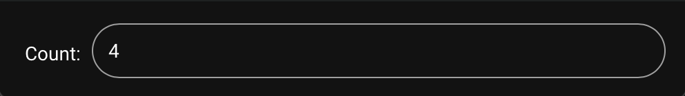

Use `ui.Number` to display a numeric entry field. Optional `limit_min` and
`limit_max` restrict the range and `precision` controls the number of decimal
places. The implementation automatically selects integer or floating point mode
based on the initial value.

```python
count = DataField(4) | ui.Number("Count", limit_min=0, limit_max=10)
```

### Slider

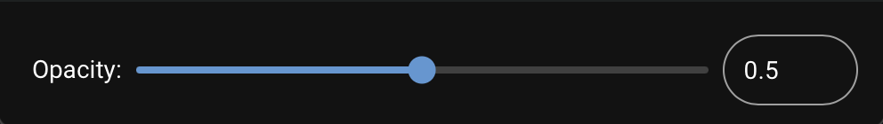

`ui.Slider` creates a slider widget. The range can be defined with
`limit_min` and `limit_max` and a `step_size` may be specified. By default
`show_number_field=True` adds an entry box next to the slider. Set it to
`False` if only the slider should be visible.

```python
opacity = DataField(0.5) | ui.Slider("Opacity", limit_min=0, limit_max=1)
```

### Boolean

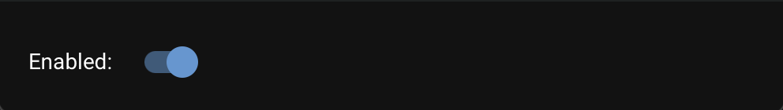

`ui.Boolean` shows a check box or switch for boolean values.

```python
enabled = DataField(True) | ui.Boolean("Enabled")
```

### Text


Use `ui.Text` for single line text entry. A placeholder text can be
configured and the widget can copy its content with `copy_content=True`.

```python
message = DataField("Hello") | ui.Text("Message", placeholder_text="enter text")
```

### Options

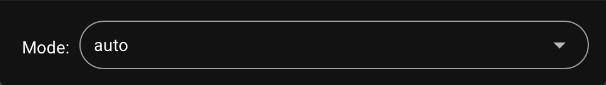

`ui.Options` displays a drop down list populated with custom values. The list
of choices is passed as a sequence.

```python
mode = DataField("auto") | ui.Options("Mode", ["auto", "manual"])
```

### Enum

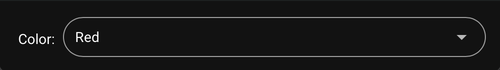

`ui.Enum` works similar to `Options` but automatically derives the
choices from an enum type.

```python
class Color(Enum):
    Red = 0
    Green = 1
    Blue = 2


color = DataField(Color.Red) | ui.Enum("Color")
```

### Vector

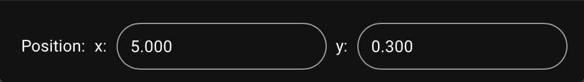

`ui.Vector` allows editing of a fixed length vector of numeric components.
It accepts `vector.obj(x=1, y=2, z=3, t=0)` objects in 2D, 3D or 4D form.
Use `decimal_precision` to control formatting and `labels` to name the
components.

```python
import vector

position = DataField(vector.obj(x=5.0, y=0.3)) | ui.Vector("Position")
velocity = DataField(vector.obj(x=5.0, y=0.3, z=1)) | ui.Vector("Velocity")
acceleration = DataField(vector.obj(x=5.0, y=0.3, z=1, t=0.5)) | ui.Vector("Acceleration")
```

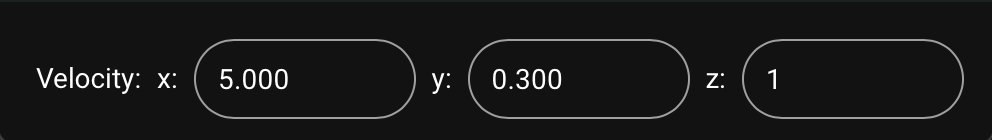
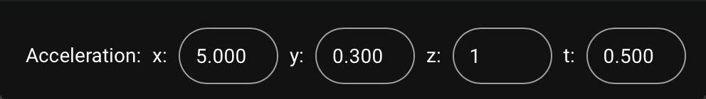

### List

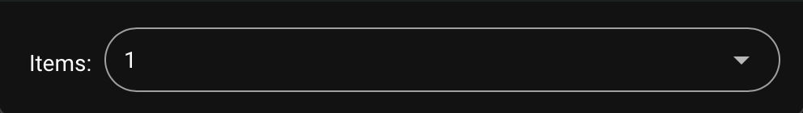

`ui.List` shows a selectable list of items. It works together with
`DataList` or `SelectableDataList` models so that changes in the list are
reflected automatically.

```python
from duit.model.DataList import DataList

items = SelectableDataList([1, 2, 3]) | ui.List("Items")
```

### Path

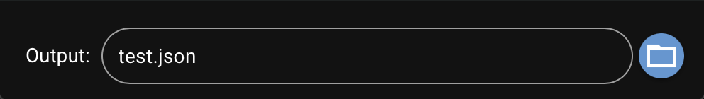

Use `ui.Path` to choose files or directories with a dialog. The annotation
supports three dialog types: `DialogType.OpenFile`, `DialogType.OpenDirectory`
and `DialogType.SaveFile`. The value should be a `Path` object from
`pathlib`. File filters are defined as a mapping of file extensions to
descriptions, for example `{".json": "JSON"}`.

```python
from pathlib import Path
from duit.ui.annotations.PathAnnotation import DialogType

output_file = DataField(Path("test.json")) | ui.Path("Output", dialog_type=DialogType.SaveFile, filters={".json": "JSON"})
```

### Progress

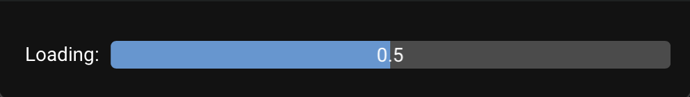

`ui.Progress` displays a read only progress bar. The value is expected to
be a float between 0 and 1.

```python
loading = DataField(0.5) | ui.Progress("Loading")
```

### Action

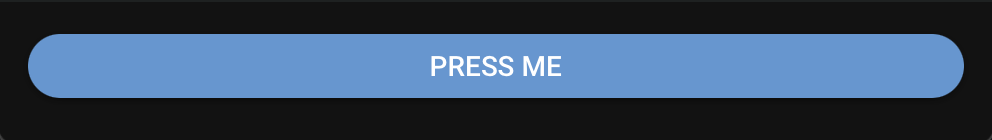

`ui.Action` shows a button that triggers a callable. By default the
callable runs in a separate thread so the UI does not block. Set
`threaded=False` to execute it on the main thread.

```python
on_hello = DataField(say_hello) | ui.Action("Press Me")
```

### Title


`ui.Title` inserts a static label or title into the panel and can also
bind to a data field for dynamic text.

```python
title = DataField("Hello world") | ui.Title(text_color=(255, 255, 0))
```

## UI Sections

To structure a configuration into different settings, it is possible to use section annotations. Due to the complexity, it is recommended to use a helper class to handle the definition of sections. Here is an example of how to define a subsection. Since the `with` scope is used, the programming interface for the `Config` class is not changed.

```python
from duit.ui.ContainerHelper import ContainerHelper


class Config:
    def __init__(self):
        container_helper = ContainerHelper(self)

        with container_helper.section("User"):
            self.device = DataField(0) | ui.Number("Device")
            self.write_output = DataField(False) | ui.Boolean("Write Output", readonly=True)

        # create section for debug parameters
        with container_helper.section("Debug"):
            self.debug_text = DataField("123") | ui.Text("Dbg", tooltip="The debug text.")
            self.threshold = DataField(127) | ui.Slider("Threshold", limit_min=0, limit_max=255)
```

When rendered, the following GUI is created, as well as any necessary bindings between the UI widgets and the
data fields.


